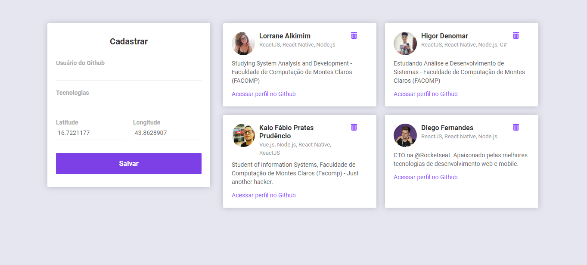
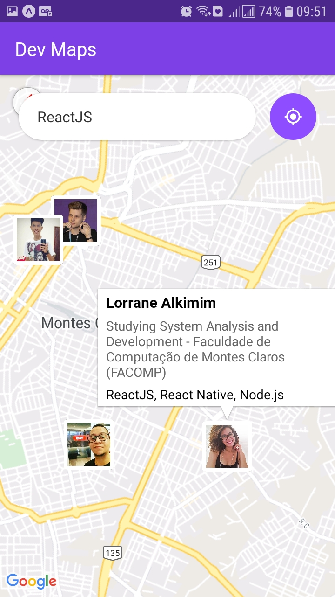
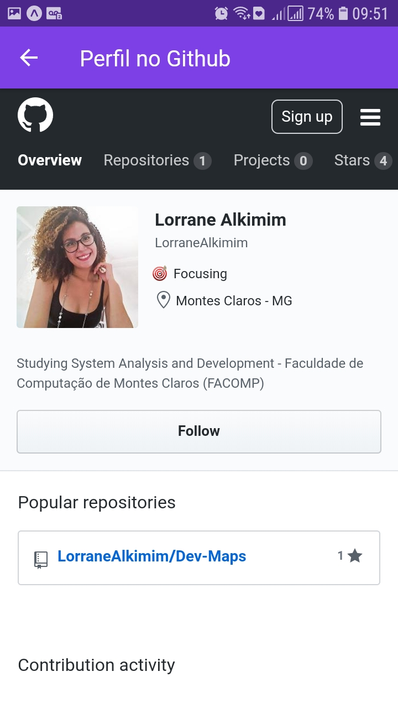

<h1 align="center">
  Dev Maps
</h1>

<h4 align="center">
  🚀 Semana OmniStack #10
</h4>

## 📌 Projeto
Este projeto visa conectar desenvolvedores em um raio de 10km, facilitando a busca através das tecnologias com que trabalham.

  &nbsp;
 
 

## 💻 Tecnologias
Esse projeto foi desenvolvido com as seguintes tecnologias:

- [Node.js](https://nodejs.org/en/)
- [React](https://reactjs.org)
- [React Native](https://facebook.github.io/react-native/)
- [Expo](https://expo.io/)
